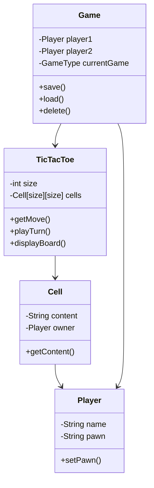

# Class diagram

```mermaid
classDiagram
    Cell : -String content
    Cell : -Player owner
    Cell: +getContent()
    Player : -String name
    Player : -String pawn
    Player: +setPawn()  
    Game : -Player player1
    Game : -Player player2
    Game : -GameType currentGame
    Game: +save()
    Game: +load()
    Game: +delete()
    TicTacToe : -int size
    TicTacToe : -Cell[size][size] cells
    TicTacToe: +getMove()
    TicTacToe: +playTurn()
    TicTacToe: +displayBoard()
    Game --> TicTacToe
    TicTacToe --> Cell
    Cell --> Player
    Game --> Player
``` 