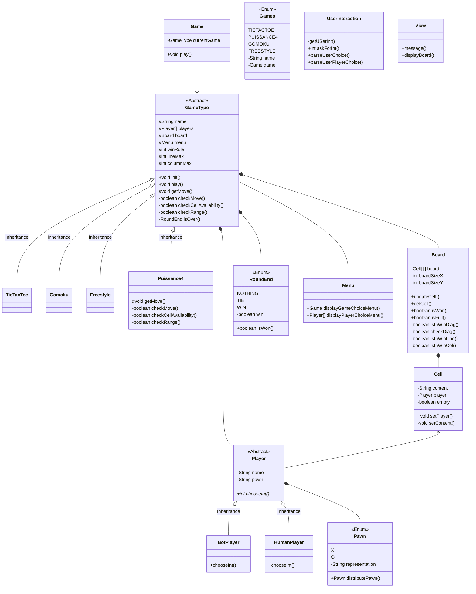

# Class diagram

```mermaid
classDiagram
    class Cell {
        -String content
        -Player player
        -boolean empty

        +void setPlayer()
        -void setContent()
    }

    class Player {
        <<Abstract>>
        -String name
        -String pawn

        +int chooseInt()*
    }
    class HumanPlayer{
        +chooseInt()
    }
    class BotPlayer{
        +chooseInt()
    }
    class Game {
        -GameType currentGame
        +void play()
    }
    class GameType  {
        <<Abstract>>
        #String name
        #Player[] players
        #Board board
        #Menu menu
        #int winRule
        #int lineMax
        #int columnMax

        +void init()
        +void play()
        #void getMove()
        -boolean checkMove()
        -boolean checkCellAvailability()
        -boolean checkRange()
        -RoundEnd isOver()
    }
    class TicTacToe {
    }
    class Gomoku{
    }
    class Freestyle{
    }
    class Puissance4{
        #void getMove()
        -boolean checkMove()
        -boolean checkCellAvailability()
        -boolean checkRange()
    }

    class Board {
        -Cell[][] board
        -int boardSizeX
        -int boardSizeY

        +updateCell()
        +getCell()
        +boolean isWon()
        +boolean isFull()
        -boolean isInWinDiag()
        -boolean checkDiag()
        -boolean isInWinLine()
        -boolean isInWinCol()
    }

    class Pawn {
        <<Enum>>
        X
        O
        -String representation

        +Pawn distributePawn()
    }

    class RoundEnd{
        <<Enum>>
        NOTHING
        TIE
        WIN
        -boolean win

        +boolean isWon()
    }

    class Games{
        <<Enum>>
        TICTACTOE
        PUISSANCE4
        GOMOKU
        FREESTYLE
        -String name
        -Game game
    }

    class Menu{
        +Game displayGameChoiceMenu()
        +Player[] displayPlayerChoiceMenu()
    }

    class UserInteraction {
        -getUSerInt()
        +int askForInt()
        +parseUserChoice()
        +parseUserPlayerChoice()
    }

    class View{
        +message()
        +displayBoard()
    }

    GameType <|-- TicTacToe : Inheritance
    GameType <|-- Gomoku : Inheritance
    GameType <|-- Freestyle : Inheritance
    GameType <|-- Puissance4 : Inheritance
    GameType*--Player
    GameType*--Board
    GameType--Menu
    GameType*--RoundEnd

    Board*--Cell

    Player<|--BotPlayer : Inheritance
    Player<|--HumanPlayer : Inheritance
    Player*--Pawn
    Game --> GameType

    Cell <-- Player


``` 