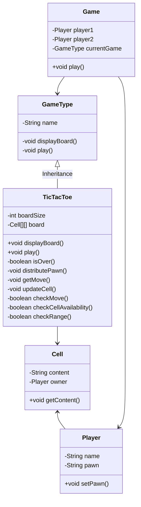

# Class diagram

```mermaid
classDiagram
    class Cell{
        -String content
        -Player owner
        +void getContent()
    }
    class Player{
        -String name
        -String pawn
        +void setPawn()
    }
    class GameType {
        -String name
        -void displayBoard()
        -void play()
    }
    class Game {
        -Player player1
        -Player player2
        -GameType currentGame
        +void play()
    }
    class TicTacToe {
        -int boardSize
        -Cell[][] board
        +void displayBoard()
        +void play()
        -boolean isOver()
        -void distributePawn()
        -void getMove()
        -void updateCell()
        -boolean checkMove()
        -boolean checkCellAvailability()
        -boolean checkRange()
    }
    GameType <|-- TicTacToe : Inheritance
    Game --> GameType
    TicTacToe --> Cell
    Cell <-- Player
    Game --> Player
``` 