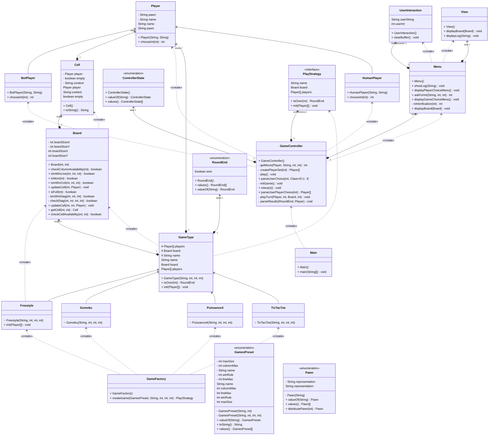

# Class diagram


## OLD VERSION
```classDiagram
class Cell {
-String content
-Player player
-boolean empty

+void setPlayer()
-void setContent()
}

class Player {
    <<Abstract>>
    -String name
    -String pawn

    +int chooseInt()*
}
class HumanPlayer{
    +chooseInt()
}
class BotPlayer{
    +chooseInt()
}
class Game {
    -GameType currentGame
    +void play()
}
class GameType  {
    <<Abstract>>
    #String name
    #Player[] players
    #Board board
    #Menu menu
    #int winRule
    #int lineMax
    #int columnMax

    +void init()
    +void play()
    #void getMove()
    -boolean checkMove()
    -boolean checkCellAvailability()
    -boolean checkRange()
    -RoundEnd isOver()
}
class TicTacToe {
}
class Gomoku{
}
class Freestyle{
}
class Puissance4{
    #void getMove()
    -boolean checkMove()
    -boolean checkCellAvailability()
    -boolean checkRange()
}

class Board {
    -Cell[][] board
    -int boardSizeX
    -int boardSizeY

    +updateCell()
    +getCell()
    +boolean isWon()
    +boolean isFull()
    -boolean isInWinDiag()
    -boolean checkDiag()
    -boolean isInWinLine()
    -boolean isInWinCol()
}

class Pawn {
    <<Enum>>
    X
    O
    -String representation

    +Pawn distributePawn()
}

class RoundEnd{
    <<Enum>>
    NOTHING
    TIE
    WIN
    -boolean win

    +boolean isWon()
}

class Games{
    <<Enum>>
    TICTACTOE
    PUISSANCE4
    GOMOKU
    FREESTYLE
    -String name
    -Game game
}

class Menu{
    +Game displayGameChoiceMenu()
    +Player[] displayPlayerChoiceMenu()
}

class UserInteraction {
    -getUSerInt()
    +int askForInt()
    +parseUserChoice()
    +parseUserPlayerChoice()
}

class View{
    +message()
    +displayBoard()
}

GameType <|-- TicTacToe : Inheritance
GameType <|-- Gomoku : Inheritance
GameType <|-- Freestyle : Inheritance
GameType <|-- Puissance4 : Inheritance
GameType*--Player
GameType*--Board
GameType--Menu
GameType*--RoundEnd

Board*--Cell

Player<|--BotPlayer : Inheritance
Player<|--HumanPlayer : Inheritance
Player*--Pawn
Game --> GameType

Cell <-- Player
